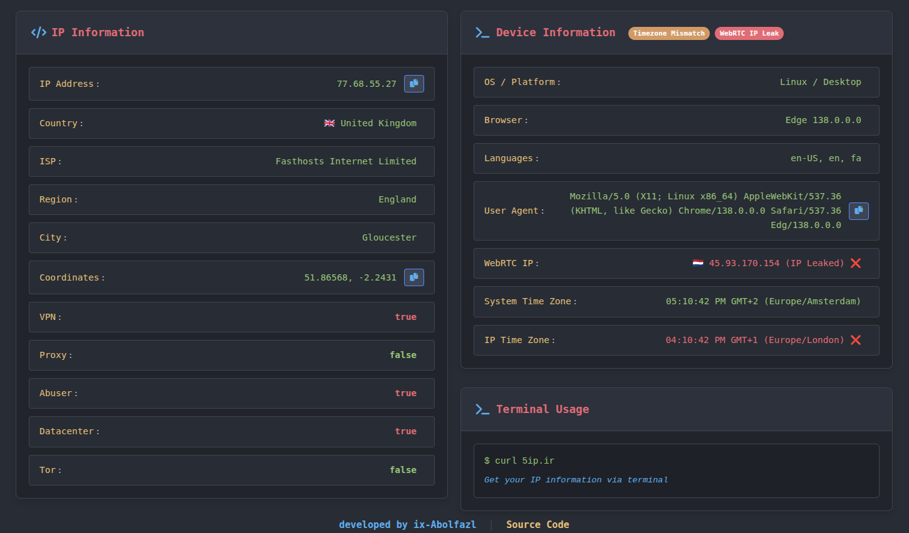

# IP Information With Cloudflare Worker

A simple Cloudflare Worker that displays visitor's IP address, location, device information, and timezone data. Shows a modern web interface for browsers and terminal output for curl requests.

## What it does

- Shows your IP address and geolocation (country, city, ISP)
- Detects your browser, operating system, and device type
- Displays timezone comparison between your system and IP location
- Works in browsers (web interface) and terminal


## Demo

[https://5ip.ir/](https://5ip.ir/)



## Quick Setup

1. **Using Cloudflare Dashboard:**
   - Go to [Cloudflare Dashboard](https://dash.cloudflare.com) → Workers & Pages
   - Click "Create" → "Start with Hello World!"
   - Copy the code from `worker.js` and paste it
   - Click "Save and Deploy"

2. **Using Wrangler CLI:**
   ```bash
   npm install -g wrangler
   wrangler login
   wrangler deploy
   ```

## Usage

**In Browser:** Visit your worker URL to see the web interface

**In Terminal:** 
```bash
curl 5ip.ir
```

